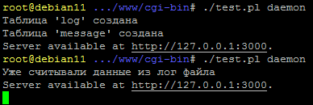

# Тестовое задание 
## Формулировка задачи

### Выполнить разбор файла почтового лога, залить данные в БД и организовать поиск по адресу получателя.
<u>_Исходные данные:_</u>
1. Файл лога maillog
2. Схема таблиц в БД (допускается использовать postgresql или mysql):
```mysql
CREATE TABLE message (
created TIMESTAMP(0) WITHOUT TIME ZONE NOT NULL,
id VARCHAR NOT NULL,
int_id CHAR(16) NOT NULL,
str VARCHAR NOT NULL,
status BOOL,
CONSTRAINT message_id_pk PRIMARY KEY(id)
);
CREATE INDEX message_created_idx ON message (created);
CREATE INDEX message_int_id_idx ON message (int_id);
CREATE TABLE log (
created TIMESTAMP(0) WITHOUT TIME ZONE NOT NULL,
int_id CHAR(16) NOT NULL,
str VARCHAR,
address VARCHAR
);
CREATE INDEX log_address_idx ON log USING hash (address);
```
<u>_Пояснения:_</u>

В качестве разделителя в файле лога используется символ пробела.

Значения первых полей:

* __дата__
* __время__
* __внутренний id сообщения__
* __флаг__
* __адрес получателя (либо отправителя)__
* __другая информация__

В качестве флагов используются следующие обозначения:

* __<=__ прибытие сообщения (в этом случае за флагом следует адрес отправителя)
* __=>__ нормальная доставка сообщения
* __->__ дополнительный адрес в той же доставке
* __**__ доставка не удалась
* __==__ доставка задержана (временная проблема)

В случаях, когда в лог пишется общая информация, флаг и адрес получателя не указываются.

<u>_Задачи:_</u>

1. Выполнить разбор предлагаемого файла лога с заполнением таблиц БД: 

В таблицу ***message*** должны попасть только строки прибытия сообщения (с флагом <=). Поля таблицы должны содержать следующую информацию:

* __created__ - timestamp строки лога
* __id__ - значение поля id=xxxx из строки лога
* __int_id__ - внутренний id сообщения
* __str__ - строка лога (без временной метки)

В таблицу ***log*** записываются все остальные строки:

* __created__ - timestamp строки лога
* __int_id__ - внутренний id сообщения
* __str__ - строка лога (без временной метки)
* __address__ - адрес получателя

2. Создать html-страницу с поисковой формой, содержащей одно поле (*type="text"*) для ввода адреса получателя.
Результатом отправки формы должен являться список найденных записей '<timestamp> <строка лога>' из двух 
таблиц, отсортированных по идентификаторам сообщений (*int_id*) и времени их появления в логе.
Отображаемый результат необходимо ограничить сотней записей, если количество найденных строк превышает 
указанный лимит, должно выдаваться соответствующее сообщение.

___
## Описание по решению

### Особенности решения:
* Для корректной работы решения требуется доступ к интернету (установка модулей, ссылки на cdn в коде).
* Запуск основного модуля из директории cgi-bin:

```bash
./test.pl daemon
```




### Оставляем за рамками рассмотрения:
1. Способ запуска парсера логов - в данном случае запускается разово в теле основной части.
2. Ротацию лога и прочее системное.
3. Особенности архитектуры БД и степень соответствия с ТЗ, берем структуру совместимую с доступной в тестовой среде (mariadb) из предложенной в задании.
4. Способ формирования списка зависимостей по модулям.
5. Способ первичной настройки окружения - в данном случае создан для этого скрипт **init.pl**.
6. Локализацию размещения библиотек (bootstrap css/js)
7. Функциональное тестирование

### Методика реализации:
1. Входные данные отдельно от кода
2. Выбор способа реализации/модулей для конкретной задачи
3. Разбивка на модули, сегментация кода
4. Кодинг, оформление, документирование, тестирование

### Реализация:
- [x] Входные данные отдельно от кода
    - [x] конфиг для дескриптора к БД ([database] config.ini)
    - [x] конфиг для входных данных про лог файл ([log] config.ini)
    - [x] флаг для одноразового парсинга лог файла - заносится после запуска ([flag] config.ini)
- [ ] Выбор основных модулей для ~~проекта~~ конкретной задачи
    - [x] основной скелет - [Mojolicious::Lite](https://metacpan.org/pod/Mojolicious::Lite "на metacpan.org")
    - [x] считывание конфига - Config::IniFile
    - [x] парсинг лога - Text::ParseWords
    - [ ] вьюшка - bootstrap
- [ ] Разбивка на модули, сегментация кода
    - [x] технологические библиотеки
    - [x] инициализация структуры таблиц
    - [x] парсер лога
    - [x] основная логика
    - [ ] вьюшка
- [ ] Кодирование, оформление, документирование
    - [x] создание инициализатора **init.pl** (**cpanfile**)
    - [x] создание процедур **libs/Lib1.pm**  (**config.ini**)
    - [x] оформление README.md
    - [x] создание основного тела **test.pl**
    - [ ] оформление для **test.pl**
    - [ ] документирование основного тела **test.pl**
    - [x] документирование процедур **libs/Lib1.pm**
- [ ] ~~Функциональное тестирование~~


### Внесены необходимые изменения (требуется корректировка или уточнение вводных):
1. Поле 'str' сделал типа 'text' иначе информация не умещалась (по условию это поле аналог varchar(255) раз не указана длина), но по логике обычно такие поля не менее чем 'text'


### Схема таблиц для MariaDB:
```mysql
CREATE TABLE IF NOT EXISTS `log` (
`created` timestamp NOT NULL DEFAULT current_timestamp() ON UPDATE current_timestamp(),
`int_id` char(16) NOT NULL,
`str` text DEFAULT NULL,
`address` varchar(255) DEFAULT NULL,
KEY `log_address_idx` (`address`)
) ENGINE=InnoDB DEFAULT CHARSET=utf8mb4;

CREATE TABLE IF NOT EXISTS `message` (
`created` timestamp NOT NULL DEFAULT current_timestamp() ON UPDATE current_timestamp(),
`id` varchar(255) NOT NULL,
`int_id` char(16) NOT NULL,
`str` text NOT NULL,
`status` tinyint(1) DEFAULT NULL,
PRIMARY KEY (`id`),
KEY `message_created_idx` (`created`),
KEY `message_int_id_idx` (`int_id`)
) ENGINE=InnoDB DEFAULT CHARSET=utf8mb4;
```

### Список компонентов:
* **init.pl** - использовался для настройки тестового окружения.
* **config.ini** - входные данные для подключения к БД.
* **cpanfile** - список зависимостей для установки, используется в *init.pl*.
* **test.pl** - основная программа.
* **libs/Lib1.pm** - процедуры в отдельном модуле.
* **log/out** - лог файл из задания.
